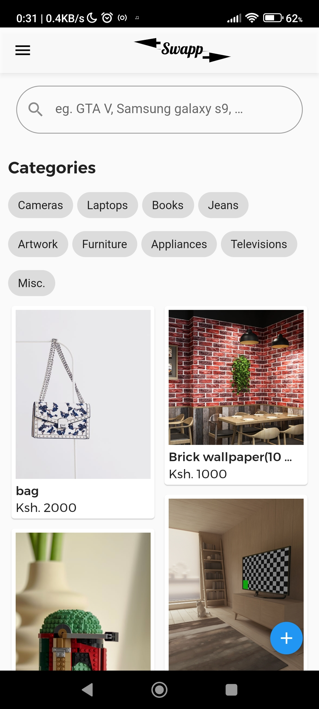
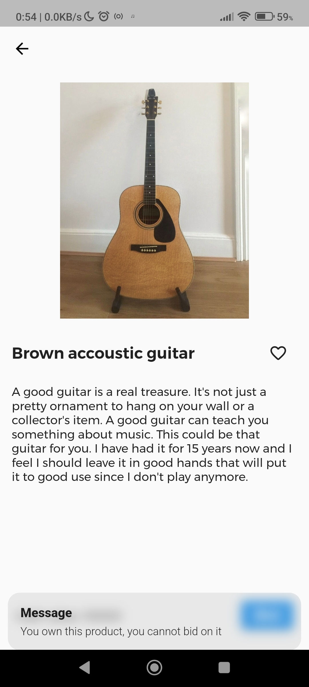
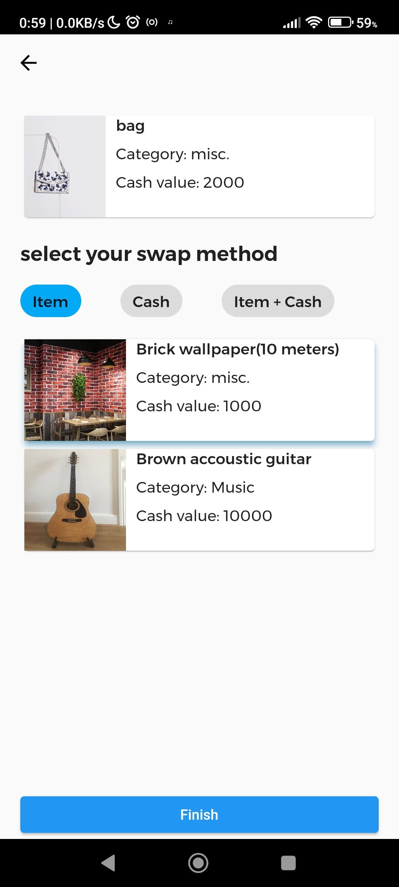

# swapp_MVP
- This is a minimum viable product (M.V.P) of Swapp, an app that allows for the exchange of unneeded items for other items or cash. The project has been delivered with Flutter as the primary framework.

## UI design
The user interface for part of the app is available here: https://dribbble.com/shots/17817188-Swapp-e-commerce-app

## The basics
- The owner of a product uploads the item with the relevant details and awaits to receive bids from interested parties. A logged in user of the app can view available products from the catalog screen.

- A party cannot place bid on an item that was uploaded from their account. If one attempts to place a bid on their own item,they will be denied progress to the  bidding screen and notified via a snackbar at the bottom of the screen. This behaviour is shown in the screenshot below.
 
 

- If the product belongs to a different account, the user will be directed to the bid screen where they can select their preffered bid method. By selecting the "cash" option on this final step, it would mean that the user wants to pay the indicated cash price. Selecting the "item" option would require the bidder to have uploaded atleast one item to have something to bid on. The same concept applies for the "item + cash" method. 
 

